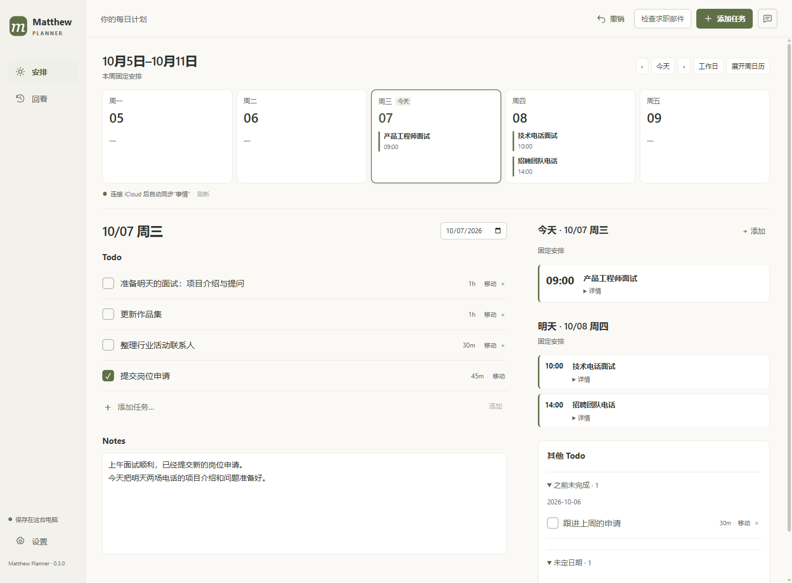

# Matthew Planner

通过 **ChatGPT Work 对话输入计划**，在 Windows 桌面查看每日 Todo、固定安排和完成记录。

你可以直接说：「明天上午 10 点有面试，今天准备项目介绍，预计 1 小时。」
明天的日历里会有面试，今天的 Todo 里会有准备任务。Todo 只指定日期和预计时长，
不需要决定几点开始或先做哪件事。

## 主要功能

- **每日 Todo**：添加、调整日期、打勾完成。完成项保持正常文字，移到清单底部。
- **今天与明天的固定安排**：今天突出显示开始时间；明天的面试与电话放在同一侧，方便提前准备。
- **本周日历**：总览只显示固定安排，也可以展开每周时间格。
- **每日 Notes**：记录进展和想法，输入框随内容增长。
- **其他 Todo**：之前未完成和未定日期的任务集中放在右下方。
- **完成回看**：完成的事情记录成可调整的本地时间块，方便回顾当天做了什么，不上传 iCloud。
- **撤销**：明确指令直接执行并保留撤销；「先讨论」或信息不明确时不改变计划。
- **可选连接**：读取 iCloud 日历的固定安排；Gmail 只读授权后，选择邮件提取相关任务和面试。只有主动发布固定安排才会写入 iCloud。

界面使用暖白底色、深灰文字和少量橄榄绿。计划保存在本机，不依赖托管后端。

## 下载与安装

从 [GitHub Releases](https://github.com/mren2222/MatthewPlanner/releases/latest) 下载 Windows x64 的 **Setup 安装包**。
安装后可从桌面或开始菜单打开，也可把图标固定到任务栏。
以后运行新版安装包即可更新同一位置，已有计划和设置会保留。
详细步骤见 [安装与更新](docs/INSTALL.md)。

## 用 ChatGPT 输入

在拥有这台 Windows 电脑访问权限的 **ChatGPT Work** 对话中描述安排，
助手读取当前计划，通过本地入口更新软件并检查结果。Codex 也能使用同一个入口。
使用连接的 Work 输入不需要在软件里填写 OpenAI API key。

**实际更新时，电脑需要在线，Matthew Planner 需要打开。**
手机上可以继续这个对话；电脑离线时先记录想法，重新连接后再告诉助手同步。
普通的、没有连接电脑的 ChatGPT 对话无法直接修改本地软件，软件也不会自动读取聊天记录。
连接方法与助手指令见 [ChatGPT Work 输入设置](docs/WORK_INPUT.md)。

## 可选设置与开发

- [iCloud 日历](docs/ICLOUD.md)
- [Gmail 只读授权](docs/GMAIL_SETUP.md)
- [应用内 AI 对话](docs/AI.md)
- [开发与验证](docs/DEVELOPMENT.md)

数据保存在 %APPDATA%\Matthew Planner；关闭软件后可备份该目录。
账户凭据使用 Windows 加密存储，迁移到另一台电脑时需要重新连接账户。
